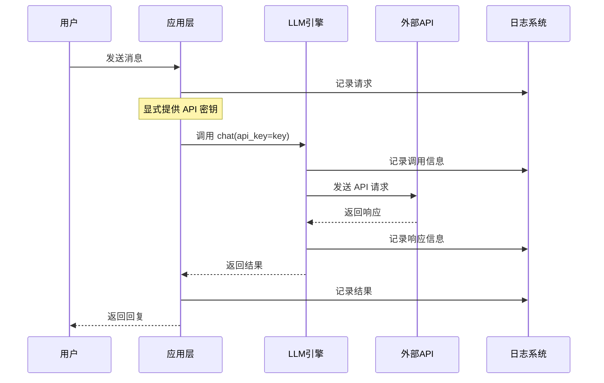
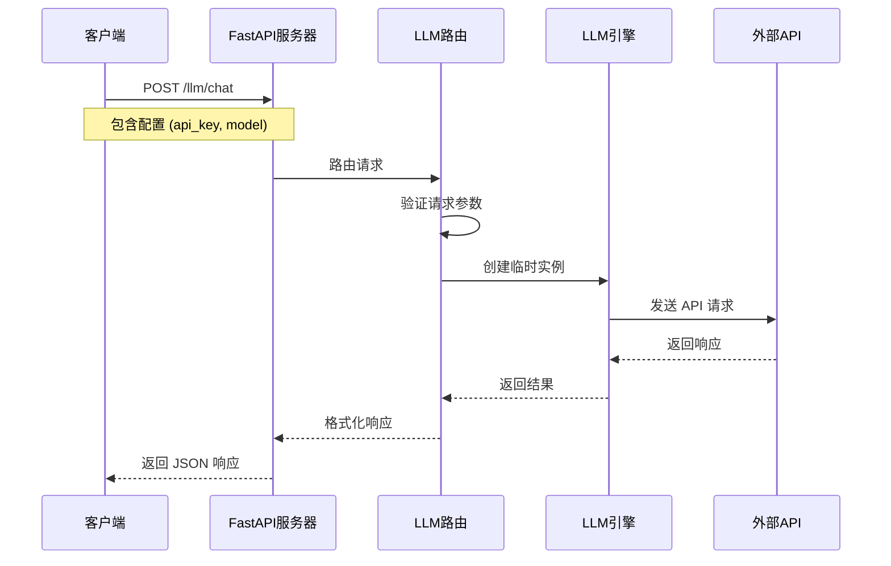
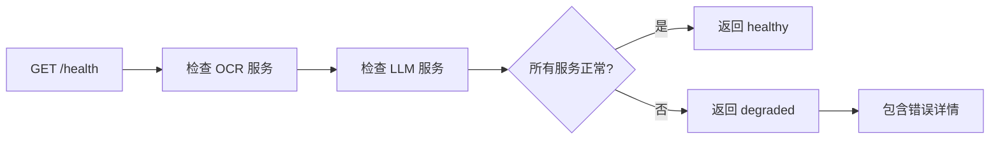

# 项目架构说明

本文档详细介绍了 MyAgent 项目的整体架构设计、模块组织和设计理念。

## 📋 目录

- [架构概览](#架构概览)
- [目录结构](#目录结构)
- [核心模块](#核心模块)
- [设计原则](#设计原则)
- [数据流](#数据流)
- [扩展性设计](#扩展性设计)
- [未来规划](#未来规划)

## 🏗️ 架构概览

MyAgent 采用模块化、分层的架构设计，旨在提供一个可扩展、易维护的智能代理开发框架。

```
┌─────────────────────────────────────────────────────────┐
│                    应用层 (Examples)                     │
├─────────────────────────────────────────────────────────┤
│                    服务层 (Server)                      │
├─────────────────────────────────────────────────────────┤
│                    模块层 (Modules)                     │
│  ┌─────────────┬─────────────┬─────────────┬──────────┐ │
│  │    Agent    │  Knowledge  │     RAG     │   MCP    │ │
│  └─────────────┴─────────────┴─────────────┴──────────┘ │
├─────────────────────────────────────────────────────────┤
│                    引擎层 (Engines)                     │
│  ┌─────────────┬─────────────┬─────────────┬──────────┐ │
│  │     LLM     │   Vector    │   Search    │  Memory  │ │
│  └─────────────┴─────────────┴─────────────┴──────────┘ │
├─────────────────────────────────────────────────────────┤
│                    基础层 (Base)                        │
│  ┌─────────────┬─────────────┬─────────────┬──────────┐ │
│  │   Logger    │   Config    │   Utils     │   Types  │ │
│  └─────────────┴─────────────┴─────────────┴──────────┘ │
└─────────────────────────────────────────────────────────┘
```

### 架构层次说明

1. **应用层**: 具体的应用实例和示例代码
2. **服务层**: Web 服务、API 接口等服务组件
3. **模块层**: 高级功能模块，如智能代理、知识库等
4. **引擎层**: 核心引擎组件，如 LLM、向量数据库等
5. **基础层**: 基础设施组件，如日志、配置管理等

## 📁 目录结构

```
myagent/
├── src/                          # 源代码根目录
│   ├── __init__.py              # 包初始化文件
│   ├── core/                    # 核心模块
│   │   ├── __init__.py
│   │   ├── base/                # 基础组件
│   │   │   ├── __init__.py
│   │   │   ├── logger.py        # 日志系统
│   │   │   ├── config.py        # 配置管理 (规划中)
│   │   │   └── utils.py         # 工具函数 (规划中)
│   │   └── engines/             # 引擎模块
│   │       ├── __init__.py
│   │       ├── llm/             # LLM 引擎
│   │       │   ├── __init__.py
│   │       │   └── base.py      # LLM 基础类
│   │       ├── ocr/             # OCR 引擎
│   │       │   ├── __init__.py
│   │       │   └── base.py      # OCR 基础类
│   │       ├── vector/          # 向量数据库引擎 (规划中)
│   │       ├── search/          # 搜索引擎 (规划中)
│   │       └── memory/          # 记忆引擎 (规划中)
│   ├── modules/                 # 功能模块
│   │   ├── agent/               # 智能代理模块 (规划中)
│   │   ├── knowledge/           # 知识库模块 (规划中)
│   │   ├── rag/                 # RAG 模块 (规划中)
│   │   └── mcp/                 # MCP 协议模块 (规划中)
│   ├── server/                  # 服务器模块
│   │   ├── __init__.py
│   │   ├── main.py              # FastAPI 主应用
│   │   ├── run_server.py        # 服务器启动脚本
│   │   └── routes/              # API 路由
│   │       ├── __init__.py
│   │       ├── llm.py           # LLM API 路由
│   │       └── ocr.py           # OCR API 路由
│   ├── client/                  # 客户端模块 (规划中)
│   ├── common/                  # 通用资源
│   │   ├── audio/               # 音频处理 (规划中)
│   │   ├── images/              # 图像处理 (规划中)
│   │   └── video/               # 视频处理 (规划中)
│   └── db/                      # 数据库模块 (规划中)
├── examples/                    # 示例代码
│   ├── llm_chat.py             # LLM 聊天示例
│   └── ocr_demo.py             # OCR 识别示例
├── docs/                        # 文档目录
│   ├── README.md               # 主文档
│   ├── llm-guide.md            # LLM 使用指南
│   ├── ocr-guide.md            # OCR 使用指南
│   ├── api-reference.md        # API 参考
│   ├── quick-start.md          # 快速开始
│   └── architecture.md         # 架构说明 (本文档)
├── conf/                        # 配置文件目录
├── tests/                       # 测试文件 (规划中)
├── requirements.txt             # Python 依赖
├── pyproject.toml              # 项目配置
├── .gitignore                  # Git 忽略文件
└── README.md                   # 项目说明
```

## 🔧 核心模块

### 1. 基础层 (Core/Base)

#### Logger 模块

**位置**: `src/core/base/logger.py`

**功能**:
- 统一的日志管理
- 多级别日志输出
- 文件和控制台双重输出
- 日志轮转和归档

**设计特点**:
```python
# 单例模式确保全局统一
logger = get_logger("ModuleName")

# 支持多种日志级别
logger.debug("调试信息")
logger.info("一般信息")
logger.warning("警告信息")
logger.error("错误信息")
```

#### Config 模块 (规划中)

**功能**:
- 配置文件管理
- 环境变量处理
- 动态配置更新
- 配置验证

#### Utils 模块 (规划中)

**功能**:
- 通用工具函数
- 数据处理工具
- 文件操作工具
- 网络工具

### 2. 引擎层 (Core/Engines)

#### LLM 引擎

**位置**: `src/core/engines/llm/base.py`

**功能**:
- 统一的 LLM 接口
- 多模型支持 (OpenAI, DashScope, 自定义端点)
- 对话上下文管理
- 前端配置支持

**设计特点**:
```python
class LLM:
    """LLM 引擎基类"""
    
    def __init__(self, model="gpt-3.5-turbo", api_key=None, base_url=None):
        """初始化配置 - api_key 现在是必需参数"""
        if not api_key:
            raise ValueError("api_key is required")
        
    def chat(self, user_input, system_prompt=None, keep_context=True, temperature=0.7):
        """统一的对话接口"""
        
    def clear_context(self):
        """清空对话上下文"""
        
    def get_context(self):
        """获取当前对话上下文"""
        
    def set_context(self, context):
        """设置对话上下文"""
```

**重要变更**:
- API 密钥现在是必需参数，不再从环境变量自动读取
- 支持前端动态配置 (通过 REST API)
- 移除了全局 LLM 实例的依赖
- 增强了错误处理和参数验证

#### OCR 引擎

**位置**: `src/core/engines/ocr/base.py`

**功能**:
- 光学字符识别
- 多种输入格式支持 (文件路径、Base64、NumPy 数组)
- 统一的识别接口
- 错误处理和日志记录

**设计特点**:
```python
class OCR:
    """OCR 引擎基类"""
    
    def __init__(self):
        """初始化 OCR 引擎"""
        
    def recognize(self, input_data):
        """统一的识别接口"""
        # 支持多种输入格式
        # 返回识别结果
```

#### Vector 引擎 (规划中)

**功能**:
- 向量数据库集成
- 相似度搜索
- 向量索引管理
- 批量处理

#### Search 引擎 (规划中)

**功能**:
- 全文搜索
- 语义搜索
- 混合搜索
- 搜索结果排序

#### Memory 引擎 (规划中)

**功能**:
- 长期记忆管理
- 短期记忆缓存
- 记忆检索
- 记忆更新

### 3. 服务层 (Server)

#### FastAPI 主应用

**位置**: `src/server/main.py`

**功能**:
- FastAPI 应用初始化
- CORS 中间件配置
- 路由注册
- 健康检查端点

**设计特点**:
```python
app = FastAPI(
    title="MyAgent API",
    description="智能代理 API 服务",
    version="1.0.0"
)

# 注册路由
app.include_router(llm_router, prefix="/llm", tags=["LLM"])
app.include_router(ocr_router, prefix="/ocr", tags=["OCR"])

# 健康检查
@app.get("/health")
async def health_check():
    return {"status": "healthy", "services": {...}}
```

#### LLM API 路由

**位置**: `src/server/routes/llm.py`

**功能**:
- LLM 聊天接口 (`POST /llm/chat`)
- 上下文管理接口 (`GET/POST/DELETE /llm/context`)
- 服务信息接口 (`GET /llm/info`)
- 健康检查接口 (`GET /llm/health`)

**设计特点**:
- 使用 Pydantic 模型进行请求/响应验证
- 支持前端配置 (API 密钥、模型、端点)
- 统一的错误处理
- 详细的 API 文档

#### OCR API 路由

**位置**: `src/server/routes/ocr.py`

**功能**:
- OCR 识别接口
- 多种输入格式支持
- 结果格式化
- 错误处理

### 3. 模块层 (Modules)

#### Agent 模块 (规划中)

**功能**:
- 智能代理框架
- 任务规划
- 工具调用
- 多代理协作

#### Knowledge 模块 (规划中)

**功能**:
- 知识库构建
- 知识图谱
- 知识检索
- 知识更新

#### RAG 模块 (规划中)

**功能**:
- 检索增强生成
- 文档处理
- 向量化
- 答案生成

#### MCP 模块 (规划中)

**功能**:
- MCP 协议支持
- 工具集成
- 资源管理
- 通信协议

## 🎯 设计原则

### 1. 模块化设计

- **单一职责**: 每个模块专注于特定功能
- **松耦合**: 模块间依赖最小化
- **高内聚**: 模块内部功能紧密相关

### 2. 分层架构

- **清晰分层**: 不同层次承担不同职责
- **依赖方向**: 上层依赖下层，避免循环依赖
- **接口抽象**: 层间通过接口交互

### 3. 可扩展性

- **插件化**: 支持功能模块的动态加载
- **配置驱动**: 通过配置文件控制行为
- **接口标准**: 统一的接口规范

### 4. 可维护性

- **代码规范**: 遵循 PEP 8 和项目规范
- **文档完善**: 详细的代码文档和使用说明
- **测试覆盖**: 高质量的单元测试和集成测试

### 5. 性能优化

- **异步处理**: 使用 async/await 提高并发性能
- **缓存机制**: 合理使用缓存减少重复计算
- **资源管理**: 有效管理内存和网络资源

## 🔄 数据流

### 1. Python SDK 对话流程



### 2. REST API 对话流程



### 3. 上下文管理流程

```mermaid
graph TD
    A[用户输入] --> B[检查系统提示]
    B --> C[添加到上下文]
    C --> D{使用方式}
    D -->|Python SDK| E[调用 LLM.chat()]
    D -->|REST API| F[POST /llm/chat]
    E --> G[调用 LLM API]
    F --> H[创建临时 LLM 实例]
    H --> G
    G --> I{API 调用成功?}
    I -->|是| J[添加回复到上下文]
    I -->|否| K[回滚用户消息]
    J --> L[返回回复]
    K --> M[抛出异常]
```

### 4. 健康检查流程



### 5. 配置管理流程

```mermaid
graph TD
    A[客户端请求] --> B{使用方式}
    B -->|Python SDK| C[直接传入配置]
    B -->|REST API| D[请求体包含配置]
    C --> E[LLM(api_key=key)]
    D --> F[解析 LLMConfig]
    F --> G[创建临时 LLM 实例]
    E --> H[执行操作]
    G --> H
    H --> I[返回结果]
```

## 🚀 扩展性设计

### 1. 引擎扩展

#### LLM 引擎扩展
- **多模型支持**: 通过统一接口支持 OpenAI、DashScope 等多种 LLM 服务
- **配置灵活性**: 支持运行时配置，无需全局设置
- **错误处理**: 统一的异常处理和错误恢复机制
- **上下文管理**: 灵活的对话上下文管理策略

```python
# 扩展新的 LLM 提供商
class CustomLLMProvider:
    def __init__(self, api_key: str, base_url: str):
        self.api_key = api_key
        self.base_url = base_url
    
    def chat(self, messages: List[Dict], **kwargs):
        # 实现自定义 LLM 调用逻辑
        pass
```

#### OCR 引擎扩展
- **多输入格式**: 支持文件路径、Base64、NumPy 数组等多种输入
- **结果格式化**: 统一的 OCR 结果格式
- **性能优化**: 支持批量处理和异步操作

### 2. 服务器扩展

#### API 路由扩展
```python
# 添加新的 API 路由
from fastapi import APIRouter

router = APIRouter(prefix="/custom", tags=["custom"])

@router.post("/endpoint")
async def custom_endpoint(request: CustomRequest):
    # 实现自定义逻辑
    return {"result": "success"}
```

#### 中间件扩展
```python
# 添加自定义中间件
from fastapi import Request
from starlette.middleware.base import BaseHTTPMiddleware

class CustomMiddleware(BaseHTTPMiddleware):
    async def dispatch(self, request: Request, call_next):
        # 预处理
        response = await call_next(request)
        # 后处理
        return response
```

### 3. 配置扩展

#### 环境配置
- **多环境支持**: 开发、测试、生产环境配置分离
- **动态配置**: 支持运行时配置更新
- **配置验证**: 使用 Pydantic 进行配置验证

```python
from pydantic import BaseSettings

class CustomConfig(BaseSettings):
    custom_api_key: str
    custom_endpoint: str
    
    class Config:
        env_file = ".env"
```

#### 模型配置
- **模型参数**: 支持自定义模型参数（temperature、max_tokens 等）
- **提供商配置**: 支持多个 LLM 提供商的配置
- **默认值管理**: 合理的默认配置和覆盖机制

### 4. 客户端扩展

#### Python SDK 扩展
```python
# 扩展 LLM 类功能
class ExtendedLLM(LLM):
    def __init__(self, api_key: str, **kwargs):
        super().__init__(api_key, **kwargs)
        self.custom_features = {}
    
    def custom_method(self, **kwargs):
        # 实现自定义功能
        pass
```

#### REST API 客户端
```javascript
// JavaScript 客户端扩展
class MyAgentClient {
    constructor(baseUrl) {
        this.baseUrl = baseUrl;
    }
    
    async customRequest(endpoint, data) {
        // 实现自定义请求逻辑
        return fetch(`${this.baseUrl}${endpoint}`, {
            method: 'POST',
            headers: {'Content-Type': 'application/json'},
            body: JSON.stringify(data)
        });
    }
}
```

### 5. 插件系统（规划中）

#### 插件接口
```python
from abc import ABC, abstractmethod

class Plugin(ABC):
    @abstractmethod
    def initialize(self, config: dict):
        """初始化插件"""
        pass
    
    @abstractmethod
    def process(self, data: Any) -> Any:
        """处理数据"""
        pass
```

#### 插件管理器
```python
class PluginManager:
    def __init__(self):
        self.plugins = {}
    
    def register_plugin(self, name: str, plugin: Plugin):
        """注册插件"""
        self.plugins[name] = plugin
    
    def execute_plugin(self, name: str, data: Any):
        """执行插件"""
        return self.plugins[name].process(data)
```

## 📈 未来规划

### 短期目标 (1-3 个月)

1. **完善 LLM 引擎**
   - 支持更多模型提供商
   - 添加流式输出
   - 优化错误处理

2. **添加配置管理**
   - 配置文件支持
   - 环境变量管理
   - 动态配置更新

3. **基础工具模块**
   - 文件处理工具
   - 网络请求工具
   - 数据处理工具

### 中期目标 (3-6 个月)

1. **向量数据库引擎**
   - 支持 Faiss、Chroma
   - 向量索引管理
   - 相似度搜索

2. **RAG 模块**
   - 文档处理
   - 向量化
   - 检索增强生成

3. **Web 服务**
   - FastAPI 接口
   - WebSocket 支持
   - API 文档

### 长期目标 (6-12 个月)

1. **智能代理框架**
   - 任务规划
   - 工具调用
   - 多代理协作

2. **知识库系统**
   - 知识图谱
   - 知识检索
   - 知识更新

3. **MCP 协议支持**
   - 工具集成
   - 资源管理
   - 标准化接口

## 🔗 相关资源

- [设计模式参考](https://refactoring.guru/design-patterns)
- [Python 架构指南](https://docs.python-guide.org/)
- [FastAPI 文档](https://fastapi.tiangolo.com/)
- [异步编程指南](https://docs.python.org/3/library/asyncio.html)

---

本架构文档会随着项目发展持续更新，欢迎提出建议和改进意见。